# 🛡️ Cyberbullying Detection using DistilBERT and Explainable AI

## 📌 Overview

This project presents an AI-powered Cyberbullying Detection System that classifies social media posts into:

- Cyberbullying
- Non-Cyberbullying

The system leverages **DistilBERT**, a lightweight transformer model, for text classification and incorporates **Explainable AI (XAI)** techniques such as **LIME** and **SHAP** to improve transparency and interpretability.

The project also includes:
- Data preprocessing and cleaning
- Exploratory Data Analysis (EDA)
- Hyperparameter optimization using Optuna
- Model evaluation with multiple metrics
- Explainable AI visualizations

---

## 🚀 Features

✅ Text Cleaning & Preprocessing

✅ Exploratory Data Analysis (EDA)

✅ DistilBERT Fine-Tuning

✅ Hyperparameter Optimization using Optuna

✅ Binary Cyberbullying Classification

✅ Confusion Matrix & ROC Curve

✅ LIME Explanations

✅ SHAP Explanations

✅ Explainable AI for Trustworthy Predictions

---

## 🏗️ Tech Stack

| Category | Tools |
|-----------|---------|
| Language | Python |
| Deep Learning | PyTorch |
| NLP | Hugging Face Transformers |
| Model | DistilBERT |
| Hyperparameter Tuning | Optuna |
| Explainability | LIME, SHAP |
| Data Processing | Pandas, NumPy |
| Visualization | Matplotlib, Seaborn, WordCloud |
| Evaluation | Scikit-Learn |

---

## 📂 Dataset

The dataset contains tweets categorized into:

- Not Cyberbullying
- Age-based Cyberbullying
- Gender-based Cyberbullying
- Ethnicity-based Cyberbullying
- Religion-based Cyberbullying

For binary classification:

```
Not Cyberbullying → Non-Bullying
All Other Classes → Cyberbullying
```

---

## ⚙️ Project Workflow

```text
Data Collection
        ↓
Text Cleaning
        ↓
Exploratory Data Analysis
        ↓
Label Encoding
        ↓
Train-Test Split
        ↓
DistilBERT Tokenization
        ↓
Hyperparameter Tuning (Optuna)
        ↓
Model Training
        ↓
Evaluation
        ↓
LIME & SHAP Explanations
```

---

# 📊 Exploratory Data Analysis

## Class Distribution

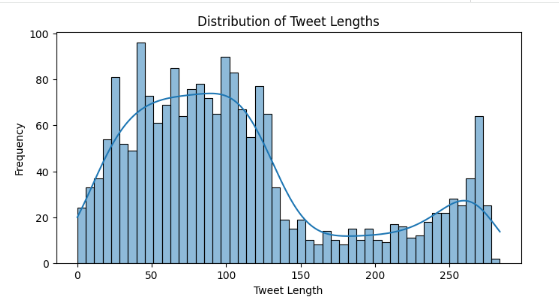

---

## Word Cloud

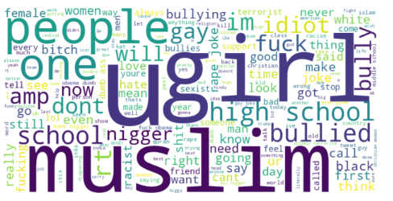

---

## 📈 Model Performance

### Classification Report

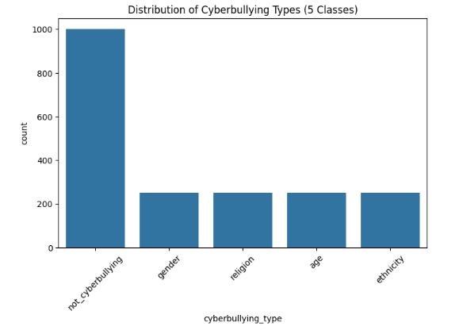

---

### Evaluation Metrics

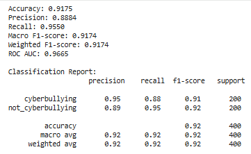

---

### Confusion Matrix

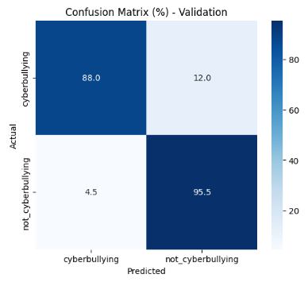

---

### ROC Curve

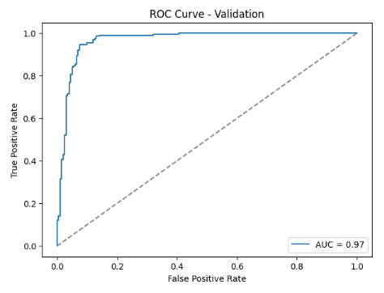

---

### Training vs Validation Performance

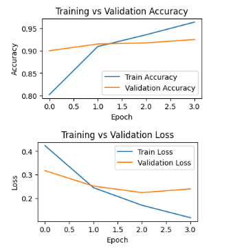

---

# 🔍 Explainable AI (XAI)

## LIME Explanation

LIME explains individual predictions by highlighting the words that contributed most toward a prediction.

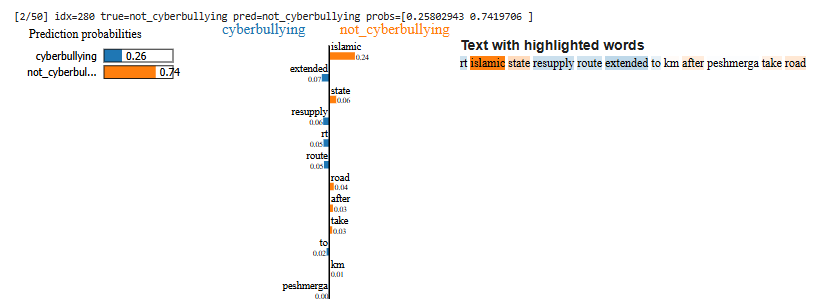

---

## Important LIME Features

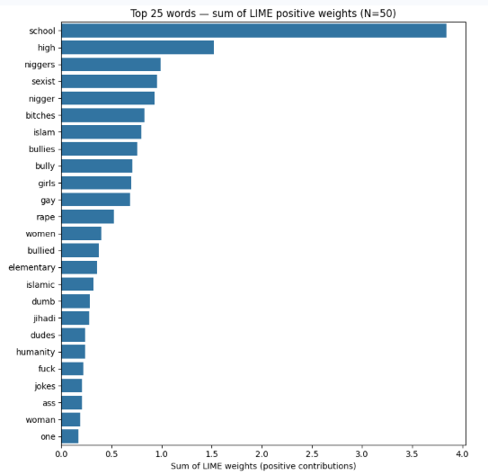

---

## SHAP Explanation

SHAP quantifies the contribution of each word toward the model's decision.

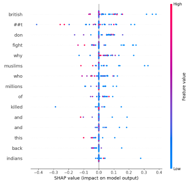

---

## SHAP Tweet-Level Explanation

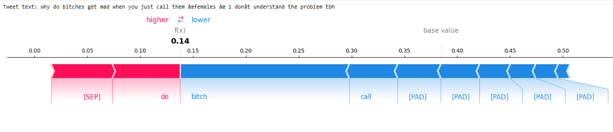

---

## 📋 Installation

Clone the repository:

```bash
git clone https://github.com/yourusername/cyberbullying-detection.git
cd cyberbullying-detection
```

Install dependencies:

```bash
pip install -r requirements.txt
```

---

## ▶️ Run

Open the notebook or Python script:

```bash
python pyml_paper_code.py
```

or run in Google Colab.

---

## 📊 Model Highlights

- Transformer-based NLP model
- DistilBERT fine-tuning
- Optuna hyperparameter tuning
- Explainable AI integration
- LIME and SHAP visualizations
- End-to-end cyberbullying detection pipeline

---

## 🎯 Future Enhancements

- RoBERTa Ensemble
- BiLSTM + Transformer Hybrid Model
- Counterfactual Explanations
- Saliency Maps
- Grad-CAM for NLP
- Multi-class Cyberbullying Detection
- Web Deployment using Streamlit
